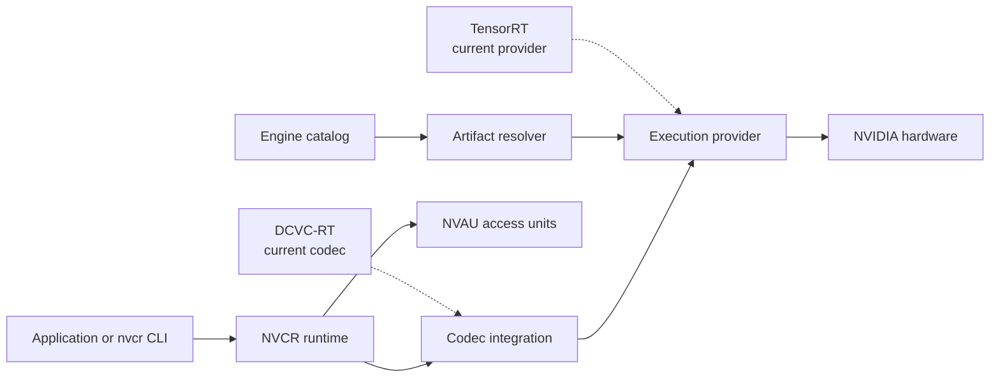

# NVCR — Neural Video Codec Runtime

NVCR is a native C++ runtime for running neural video codecs as usable
applications. It gives a learned compression method the parts it needs in
practice: encode and decode sessions, GPU execution, compatible inference
engines, a portable bitstream, a command-line tool, packages, and containers.

[DCVC-RT](https://github.com/microsoft/DCVC) is NVCR's first codec integration.
It provides the learned compression method and models. NVCR provides the
runtime around it, so the same architecture can later host other codecs and
execution providers.

## What NVCR provides

- A C++ runtime that manages stateful video encoding and decoding.
- Separate codec and execution-provider boundaries, so codec logic is not tied
  to one GPU backend.
- Automatic selection of the compatible model and TensorRT engine for the
  current GPU and installed runtime.
- `NVAU`, NVCR's versioned access-unit format for carrying compressed video.
- Native packages, Docker images, a CLI, and tested Linux and Jetson workflows.

## Run NVCR on Linux

The default path is a native Linux installation on Ubuntu 24.04 x86_64 with an
NVIDIA GPU supported by the public engine catalog, CUDA 12.8, and TensorRT 10.9.
You will also need Python 3, `curl`, `tar`, `sha256sum`, and network access.

Resolve the current stable release once and install the QCIF engine for the
detected GPU:

```bash
export NVCR_RELEASE="$(
  curl -fsSL https://api.github.com/repos/0elghati/nvcr/releases/latest |
    python3 -c 'import json, sys; print(json.load(sys.stdin)["tag_name"])'
)"

curl -fsSLo /tmp/nvcr-install.sh \
  "https://raw.githubusercontent.com/0elghati/nvcr/${NVCR_RELEASE}/scripts/install.sh"
bash /tmp/nvcr-install.sh --tag "$NVCR_RELEASE" --profile qcif
export PATH="$HOME/.local/nvcr/bin:$PATH"
```

Create a four-frame QCIF input and run the complete encode/decode path:

```bash
export NVCR_WORK_DIR="$PWD/nvcr-example"
mkdir -p "$NVCR_WORK_DIR"

python3 - "$NVCR_WORK_DIR/input.yuv" <<'PY'
from pathlib import Path
import sys

width, height, frames = 176, 144, 4
frame = bytes([16]) * (width * height) + bytes([128]) * (width * height // 2)
Path(sys.argv[1]).write_bytes(frame * frames)
PY

test "$(stat -c %s "$NVCR_WORK_DIR/input.yuv")" -eq 152064
nvcr codec list
nvcr provider list
nvcr encode \
  -i "$NVCR_WORK_DIR/input.yuv" \
  -o "$NVCR_WORK_DIR/output.nvcr" \
  -s 176x144 -r 30 --frames 4 --gop-size 2 --qp 32
nvcr decode \
  -i "$NVCR_WORK_DIR/output.nvcr" \
  -o "$NVCR_WORK_DIR/reconstructed.yuv" \
  --quality-metrics "$NVCR_WORK_DIR/input.yuv"

test -s "$NVCR_WORK_DIR/output.nvcr"
test "$(stat -c %s "$NVCR_WORK_DIR/reconstructed.yuv")" -eq 152064
```

The run lists `dcvc-rt` and `tensorrt`, encodes and decodes four frames, and
writes a 152064-byte reconstruction. NVCR is a lossy codec, so the
reconstruction is not expected to be byte-identical to the input.

## Results

NVCR has been executed on the following NVIDIA targets. The completed results
are retained in the repository and show the strongest measured FPS for each
resolution, with the matching configuration named beside it.

### Jetson Orin

This is the inter-coded comparison point. The strongest recorded FPS comes from
GOP 100 at every resolution, and the linked report keeps GOP 30 visible too.

| Resolution | Best inter-coded GOP | Encode FPS | Decode FPS |
|---|---:|---:|---:|
| QCIF | 100 | 248.052 | 254.457 |
| CIF | 100 | 103.946 | 106.835 |
| 360p | 100 | 49.607 | 54.628 |
| 540p | 100 | 22.527 | 25.112 |
| 720p | 100 | 12.749 | 14.467 |
| 1080p | 100 | 5.830 | 6.566 |

The full report keeps the entropy comparison and the per-GOP FPS table.
[Results](results/jetson-orin/summary.md)

### RTX 4070

This is the all-intra comparison point for the entropy check, and the linked
report also shows the strongest inter-coded FPS per resolution. The strongest
recorded FPS comes from GOP 100 at every resolution.

| Resolution | Best inter-coded GOP | Encode FPS | Decode FPS |
|---|---:|---:|---:|
| QCIF | 100 | 915.816 | 1030.706 |
| CIF | 100 | 580.303 | 605.420 |
| 360p | 100 | 417.027 | 398.613 |
| 540p | 100 | 227.894 | 211.146 |
| 720p | 100 | 102.091 | 106.922 |
| 1080p | 100 | 50.323 | 51.641 |

The full report keeps the all-intra comparison context and the per-GOP FPS table. [Results](results/rtx4070/summary.md)

### RTX 5060

Portability run across QCIF to 1080p and GOP 1/8/265. [Results](results/rtx5060/summary.md)

### RTX 3050

Reserved as a future completion target.


| Environment | Procedure |
|---|---|
| Linux x86_64 with Docker | [Docker encode/decode procedure](docs/first-run.md#linux-x86_64-with-an-nvidia-gpu-and-docker) |
| Windows 11 with Docker Desktop and WSL 2 | [Windows container procedure](docs/first-run.md#windows-11-with-docker-desktop-and-an-nvidia-gpu) |
| Jetson Orin | [Native Jetson procedure](docs/first-run.md#jetson-orin-native-installation) |
| Linux without a supported NVIDIA GPU | [CPU contract validation](docs/first-run.md#cpu-only-contract-validation) |
| Build or modify NVCR | [Build and contribution guide](CONTRIBUTING.md) |

See [Installation](docs/installation.md) for package and container details,
[Docker on Linux](docs/docker-x86_64.md) for host setup, and
[Troubleshooting](docs/troubleshooting.md) if GPU or engine detection fails.

## Architecture



DCVC-RT is the first codec integration; TensorRT is the current execution
provider. NVCR keeps these boundaries separate so later codecs and providers
can use the same runtime. See [Architecture](docs/architecture.md) for the
data flow and extension points.

## Current scope

NVCR currently supports DCVC-RT with TensorRT FP16 on NVIDIA Linux: native
x86_64 packages and containers, native AArch64 packages for Jetson Orin, and
Windows-hosted execution through Docker Desktop/WSL 2. CPU builds cover runtime
and format contracts, but do not run neural inference.

NVCR is pre-v1. The C++ API/ABI is not frozen. Native Windows and macOS
execution, CPU neural inference, INT8 release support, FFmpeg integration,
standard multimedia containers, and additional codec/provider integrations are
outside the current release.

## Documentation

- [First run](docs/first-run.md)
- [Documentation map](docs/README.md)
- [Installation](docs/installation.md)
- [Command line](docs/cli.md)
- [C++ API](docs/reference.md)
- [Performance and benchmarking](docs/performance.md)
- [Results](results/README.md)

## Acknowledgements

NVCR's first codec integration is with the DCVC-RT, introduced by Zhaoyang Jia,
Bin Li, Jiahao Li, Wenxuan Xie, Linfeng Qi, Houqiang Li, and Yan Lu in
[*Towards Practical Real-Time Neural Video Compression*](https://openaccess.thecvf.com/content/CVPR2025/html/Jia_Towards_Practical_Real-Time_Neural_Video_Compression_CVPR_2025_paper.html),
and on the reference implementation and model lineage released through the
[Microsoft/DCVC repository](https://github.com/microsoft/DCVC).

CUDA and TensorRT are external NVIDIA components. The native rANS subset retains
its upstream DCVC and incorporated-source attributions. Source, license, and
redistribution boundaries are recorded in [Third-party notices](THIRD_PARTY_NOTICES.md),
[Model and checkpoint terms](MODEL_LICENSES.md), and the
[Asset distribution policy](ASSET_DISTRIBUTION_POLICY.md).

## License and citation

NVCR source is distributed under the [MIT License](LICENSE). Generic packages
exclude checkpoints, exported model assets, TensorRT plans, and datasets.

Use [CITATION.cff](CITATION.cff) to cite NVCR. For assistance or vulnerability
reporting, see [Support](SUPPORT.md) and [Security](SECURITY.md).
