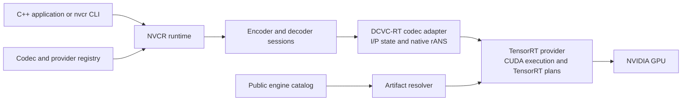
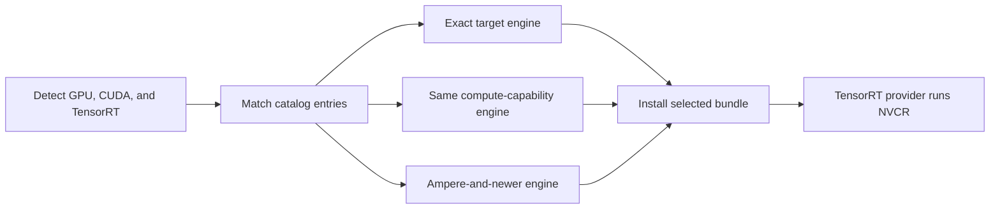
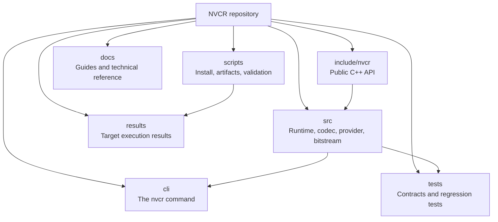

# NVCR architecture

NVCR turns a learned video-compression model into a native codec application.
The model supplies compression behaviour; NVCR supplies the runtime, GPU
execution, engine selection, bitstream handling, and delivery surfaces around
it.

## Runtime map

The runtime owns the application-facing session lifecycle. The DCVC-RT adapter
owns codec state and entropy coding. The TensorRT provider owns GPU execution.
The resolver selects an engine that matches the active target before the
provider starts work.

## Data flow

```mermaid
flowchart LR
    Raw[Raw YUV frames] --> Encode[Encode session]
    Encode --> Adapter[DCVC-RT adapter]
    Adapter --> Engine[TensorRT engine]
    Engine --> AccessUnit[NVAU access units]
    AccessUnit --> Decode[Decode session]
    Decode --> Adapter2[DCVC-RT adapter]
    Adapter2 --> Engine2[TensorRT engine]
    Engine2 --> Output[Reconstructed YUV frames]
```

`NVAU` is NVCR's bounded, versioned access-unit format. It carries the codec,
model, ordering, dependency, and payload information needed by the decoder; the
learned payload itself remains DCVC-RT-specific.

## Engine selection

NVCR prefers an exact engine. Desktop targets can use a published matching
compute-capability or broader compatibility bundle when available; Jetson uses
exact-target engines.

## Repository map

For the public C++ surface, see the [API reference](reference.md). For the
DCVC-RT implementation, see [DCVC-RT integration](dcvcrt-integration.md). For
the access-unit format, see [Bitstreams and access units](bitstream.md).
