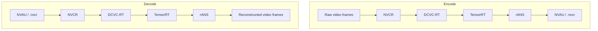
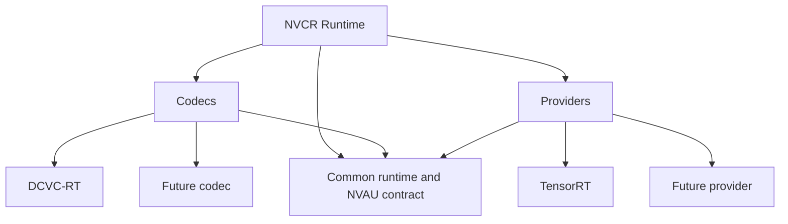

# NVCR architecture

NVCR is a runtime for neural video codecs, not a codec model itself. A codec
integration supplies compression behaviour; an execution provider runs that
integration on the available hardware. Today, NVCR integrates DCVC-RT through
TensorRT. The same boundaries leave room for other codecs and providers.

The [front-page system diagram](../README.md#architecture) shows the main
components: application, NVCR runtime, codec integration, execution provider,
engine catalog, and `NVAU` output. The diagrams below explain what happens to a
video and how NVCR can grow without becoming tied to DCVC-RT.

## Encode and decode flow

For encoding, NVCR passes frames to the selected codec integration. DCVC-RT
uses TensorRT for learned-model execution and rANS for entropy coding; NVCR
places the result in an `NVAU` access unit. Decoding follows the same path in
reverse.

## Extensibility

DCVC-RT and TensorRT are the current working pair, not NVCR's definition. New
integrations use the same runtime and `NVAU` contract while keeping their own
codec payload and hardware implementation details.

For public C++ types, see the [API reference](reference.md). For the current
DCVC-RT integration, see [DCVC-RT integration](dcvcrt-integration.md). For
`NVAU` fields and byte layout, see [Bitstreams and access units](bitstream.md).
